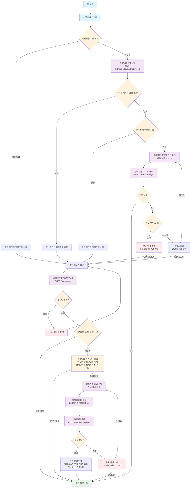

# 생체인증 API 문서

## 1. 생체인증 상태 확인

특정 사원의 생체인증 등록 상태를 확인합니다.

**Endpoint**

```
GET /biometric/status/{employeeId}
```

**Path Parameters**

| 파라미터 | 타입 | 필수 | 설명 |
|---------|------|------|------|
| employeeId | string | 필수 | 사원 ID |

**Response**

```json
{
  "isSuccess": true,
  "code": 2000,
  "message": "요청에 성공하였습니다.",
  "result": {
    "isRegistered": true,
    "availableTypes": ["FINGERPRINT", "FACE"],
    "deviceCount": 2,
    "lastUsedAt": "2024-01-15T10:30:00"
  }
}
```

**Status Codes**

- `200`: 성공
- `404`: 사용자를 찾을 수 없음

## 2. 생체인증 등록 🔒

새로운 생체인증을 등록합니다.

**Endpoint**

```
POST /biometric/register
```

**Headers**

```
Authorization: Bearer your-access-token
```

**Request Body**

```json
{
  "biometricType": "FINGERPRINT",
  "deviceId": "device-unique-id-12345",
  "biometricHash": "hashed-biometric-data",
  "deviceInfo": "Samsung Galaxy S23, Android 13"
}
```

**Request Fields**

| 필드 | 타입 | 필수 | 설명 |
|------|------|------|------|
| biometricType | string | 필수 | 생체인증 타입 (FINGERPRINT, FACE, VOICE) |
| deviceId | string | 필수 | 디바이스 고유 ID |
| biometricHash | string | 필수 | 해시된 생체 데이터 |
| deviceInfo | string | 선택 | 디바이스 정보 |

**Response**

```json
{
  "isSuccess": true,
  "code": 2001,
  "message": "생성되었습니다.",
  "result": {
    "success": true,
    "message": "생체인증 등록이 완료되었습니다.",
    "biometricId": 123,
    "errorCode": null,
    "remainingAttempts": null
  }
}
```

**Status Codes**

- `201`: 성공
- `400`: 잘못된 요청 (이미 등록된 생체인증 등)
- `401`: 인증되지 않은 요청

## 3. 생체인증 로그인

생체인증을 사용하여 로그인합니다.

**Endpoint**

```
POST /biometric/login
```

**Request Body**

```json
{
  "employeeId": "EMP001",
  "biometricType": "FINGERPRINT",
  "deviceId": "device-unique-id-12345",
  "biometricHash": "hashed-biometric-data",
  "timestamp": 1705319400000,
  "challengeResponse": "optional-challenge-response",
  "deviceFingerprint": "optional-device-fingerprint"
}
```

**Request Fields**

| 필드 | 타입 | 필수 | 설명 |
|------|------|------|------|
| employeeId | string | 필수 | 사원 ID |
| biometricType | string | 필수 | 생체인증 타입 |
| deviceId | string | 필수 | 디바이스 고유 ID |
| biometricHash | string | 필수 | 해시된 생체 데이터 |
| timestamp | number | 필수 | 타임스탬프 |
| challengeResponse | string | 선택 | 챌린지 응답 |
| deviceFingerprint | string | 선택 | 디바이스 핑거프린트 |

**Response**

```json
{
  "isSuccess": true,
  "code": 2003,
  "message": "로그인에 성공하였습니다.",
  "result": {
    "accessToken": "eyJhbGciOiJIUzI1NiIs...",
    "refreshToken": "eyJhbGciOiJIUzI1NiIs...",
    "username": "홍길동",
    "department": "개발팀",
    "expiresIn": 3600,
    "biometricEnabled": true,
    "lastLoginAt": "2024-01-15T10:30:00"
  }
}
```

**Status Codes**

- `200`: 성공
- `400`: 잘못된 요청
- `401`: 인증 실패
- `423`: 최대 시도 횟수 초과

## 4. 생체인증 해제

등록된 생체인증을 해제합니다.

**Endpoint**

```
DELETE /biometric/deactivate
```

**Query Parameters**

| 파라미터 | 타입 | 필수 | 설명 |
|---------|------|------|------|
| employeeId | string | 필수 | 사원 ID |
| deviceId | string | 필수 | 디바이스 고유 ID |
| biometricType | string | 필수 | 생체인증 타입 |

**Example Request**

```
DELETE /biometric/deactivate?employeeId=EMP001&deviceId=device-unique-id-12345&biometricType=FINGERPRINT
```

**Response**

```json
{
  "isSuccess": true,
  "code": 2000,
  "message": "요청에 성공하였습니다.",
  "result": {
    "success": true,
    "message": "생체인증이 해제되었습니다.",
    "biometricId": null,
    "errorCode": null,
    "remainingAttempts": null
  }
}
```

**Status Codes**

- `200`: 성공
- `400`: 잘못된 요청
- `404`: 생체인증 정보를 찾을 수 없음

## 생체인증 플로우차트



## Expo 개발 시 고려사항

### 1. 생체인증 라이브러리
- **expo-local-authentication**: Expo에서 제공하는 생체인증 라이브러리
- **expo-secure-store**: 민감한 데이터 저장용

### 2. 생체인증 타입 지원
- **iOS**: Touch ID, Face ID
- **Android**: Fingerprint, Face Unlock, Iris

### 3. 보안 고려사항
- 생체 데이터는 절대 원본 저장 금지
- 해시된 데이터만 서버 전송
- 디바이스 고유 ID 활용
- 타임스탬프 기반 재전송 공격 방지